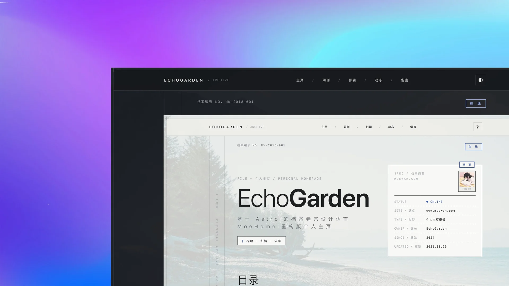

# EchoGarden（回响花园）

> **回响花园（EchoGarden）** —— 搭建一座有序的数字花园，用来存放思考，等待文字生出跨越时间的回响。

以「档案卷宗」为设计语言的个人主页开源模板（MoeHome 重构版），基于 Astro 构建。

> **仓库地址**：https://github.com/moewah/echogarden-astro.git
>
> 本仓库默认配置与内容**全部为示例数据**（不含任何真实个人数据），fork 后替换配置与内容即可搭建个人站点。
>
> 由 [MoeWah](https://www.moewah.com) 设计维护 · 开源分发版



## 特性

- **档案设计语言**：SEC 编号 / 戳记 / 登记卡等全站隐喻，编号随开关自动联动回收；8 色 token 明暗双主题，克制动效全程兼容 `prefers-reduced-motion`
- **内容与展示**：周刊（分页 / 归档 / AI 辅助阅读 / 代码高亮）、影辑（灯箱 / 高光轮播）、Memos 动态、Artalk 评论，外部接口未配置自动降级空态
- **配置化架构**：三层 config 分层，板块 `enabled` 开关联动导航 / SEO / sitemap / SEC 编号；凭据 .env 注入 + 版本锚点校验；i18n 翻译就绪
- **SEO 与运营**：JSON-LD、llms.txt / RSS / sitemap、分页治理、外链 rel 分级、统计开关（关闭时产物零统计代码）
- **双部署模式**：单一开关切换纯静态或 Node 增量刷新，三种 frontmatter 示例形态照抄即可发布

## 技术栈

- Astro 7（静态输出）+ TypeScript strict
- Tailwind CSS v4（CSS-first 配置）
- Shiki（代码高亮，`css-variables` 主题）
- Astro Content Collections（周刊、影辑）

## 快速开始

从安装到上线，按下面五步顺序走一遍即可。

### 1. 安装依赖

```bash
npm install
```

### 2. 配置站点

**① 站点身份**：`src/config/siteConfig.ts`——站点名、URL、个人资料、邮箱等。

**② 部署地址**：`astro.config.mjs`——取消注释并填入真实域名：

```js
site: 'https://your-domain.com/',
```

**③ 环境变量**：复制 `.env.example` 为 `.env`，按需填写（Memos / Artalk / GitHub，均为可选，留空自动降级）。

可选服务版本要求（构建期精确校验，必须与锚点一致，否则板块显示空态）：

| 服务 | 用途 | 要求版本 | 版本锚点（config） |
|---|---|---|---|
| Memos | 动态板块 | **= 0.30.0** | `memosConfig.version` |
| Artalk | 评论板块 | **= 2.10.0** | `artalkConfig.version` |

### 3. 本地预览

```bash
npm run dev
```

打开 `http://localhost:4321` 确认页面正常、配置生效。

### 4. 生产构建

```bash
npm run build
```

产物在 `dist/`（纯静态模式下静态文件直接在根目录，无 `dist/server/`）。

### 5. 部署上线（纯静态）

> 当前步骤为**纯静态部署**（默认模式，`memosConfig.refresh.enabled = false`，无需 Node 运行时）。
> memos 动态增量刷新（server 模式）属进阶配置，后续补充独立的手册。

把 `dist/` 发布到任意静态托管，并确认站点从 `https://your-domain.com/` 可访问。

**托管平台（任选其一）**：

| 平台 | 构建命令 | 输出目录 |
|---|---|---|
| Cloudflare Pages | `npm run build` | `dist/` |
| Vercel | `npm run build` | `dist/` |
| Netlify | `npm run build` | `dist/` |

**自有服务器（Nginx）**：

```nginx
server {
    server_name your-domain.com;
    root /path/to/echogarden-astro/dist;
    index index.html;
    location / {
        try_files $uri $uri/ /index.html;
    }
}
```

> 动态页增量刷新、Node 运行时等进阶部署：将 `memosConfig.refresh.enabled` 改为 `true`（详见部署配置注释），独立手册后续补充。

## 页面

```text
/                         首页
/weekly/                  周刊索引
/weekly/[slug]/           周刊详情
/weekly/page/N/           周刊分页
/photos/                  影辑索引
/photos/[slug]/           影辑详情
/photos/page/N/           影辑分页
/moments/                 动态
/guestbook/               留言
/llms.txt                 LLMs 文本索引
/rss.xml                  RSS
/sitemap.xml              Sitemap
```

周刊每页 10 条，影辑每页 9 条。分页页使用 `noindex, follow`，分页 URL 不进入 Sitemap。

## 内容发布

内容即 markdown 文件，放在对应目录即可：

| 内容 | 位置 | frontmatter 必填 |
|---|---|---|
| 周刊 | `src/content/weekly/{年月}-{slug}.md` | `title` / `issue` / `description` / `slug` / `cover` / `date` |
| 影辑 | `src/content/albums/{slug}.md` | `title` + `photos[]`（每张照片 `title` + `src`） |

示例文件内置了三种 frontmatter 形态（照抄即可）：

- **全量**：`demo-first-post` / `demo-city-walk`——所有可选字段都有说明
- **部分**：`demo-partial-tags` / `demo-partial-ai` / `demo-weekend`——常见取舍
- **最小**：`demo-minimal`——只填必填字段即可发布

> AI 辅助阅读按钮默认启用，无需在 frontmatter 配置。

## 配置总览

用户级配置统一位于 `src/config/`，推荐从 `@config/index` 导入。核心几个：

| 配置 | 用途 |
|---|---|
| `siteConfig.ts` | 站点身份、个人资料、公告、背景、SEO |
| `albumsConfig.ts` / `weeklyConfig.ts` | 影辑 / 周刊开关与分页数量 |
| `memosConfig.ts` / `artalkConfig.ts` | 动态 / 评论接口（凭据走 .env） |
| `analyticsConfig.ts` | GA / Clarity / Umami 统计开关 |
| `elsewhereConfig.ts` / `donationConfig.ts` | 外部触点 / 赞助方式 |

每个板块都有自己的开关（`enabled`），关闭后导航、首页板块、SEC 编号自动联动回收。详细字段说明见 `src/config/README.md`。

## 项目结构

```text
src/
├── components/         # 组件（含 sections/ 首页板块）
├── config/             # 用户级配置（唯一事实源）
├── content/            # 内容集合（albums 影辑 / weekly 周刊）
├── i18n/               # UI 文案
├── layouts/            # 布局
├── pages/              # 路由页面
├── styles/             # 设计 token（global.css）
├── types/              # 类型定义
└── utils/              # 工具函数
```

## 构建过程

这套模板是我个人主页重构的产物。重构期间的思考、取舍和踩坑，我陆续记在了周刊里——设计系统怎么定的、为什么用配置化架构、开源前做了哪些准备：

> **拾趣周刊**：https://www.moewah.com/weekly/
> - 《重做个人主页》
> - 《建站技术决策》

如果你也在折腾个人主页，希望这些记录对你有用。

## 赞助支持

如果这个模板对你有帮助，欢迎请我喝杯咖啡（微信 / 支付宝均可）：

| 微信 | 支付宝 |
|---|---|
|  |  |

## 许可证

本项目遵循 MIT license 开源协议，详细查看 [LICENSE](LICENSE) 文件。

**版权声明：**

> **POWERED BY [ECHOGARDEN](https://github.com/moewah/echogarden-astro) & [MOEWAH](https://www.moewah.com)**
>
> 根据 MIT 开源协议，你可以自由使用、修改、分发代码，但需保留上述版权声明。
